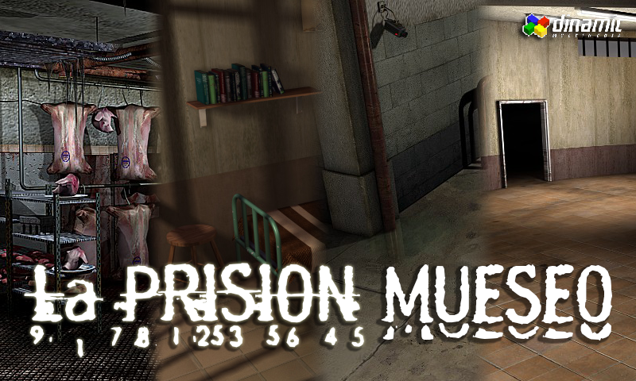

# La Prisión - Museo

## Resumen
Recorre la prisión creada por _Dinamic Multimedia_ con los graficos originales del juego. Comparte con otros usuarios tu
experiencia, descubre detalles ineditos en cada sala y encuentra los objetos ocultos antes que nadie para obtener 
ventajas unicas en la salida oficial de La Prisión - Reloaded.

> La Prisión - Museo y La Prisión - Reloaded no tienen ninguna relación legal ni con Dinamic Multimedia, Cryonetworks ni
> Service Online Worlds.

## Caracteristicas
- Recorre la totalidad de La Prisión en su ultimo estado conocido en el año 2018
- Comparte con otros usuarios el recorrido, podrás ver sus propios cursores analizando cada zona y chateando con ellos
- Cada 24 horas un objeto unico aparecerá en algun lugar oculto de La Prisión. Encuentralo para obtener ventajas cuando salga La Prisión - Reloaded.
- Apoya a la recreación del recorrido. Si ves que alguna zona conecta con otra de forma incorrecta a como lo hacia el juego original, podras generar un pull request para arreglarlo

## Tecnologias usadas
- SFML 2.5.1
- Socket.io
