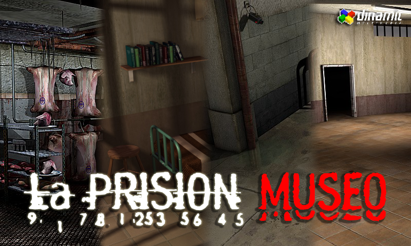

# La Prisión - Museo

> **Warning**
>
> Este proyecto se encuentra bajo desarrollo. Su estado actual es INJUGABLE.

## Resumen
Recorre la prisión creada por Dinamic Multimedia con los gráficos originales del juego. Comparte con otros usuarios tu 
experiencia, descubre detalles inéditos en cada sala y encuentra los objetos ocultos antes que nadie para obtener
ventajas únicas en la salida oficial de La Prisión - Reloaded.

Obten más información en https://forum.prisonserver.net/

> **Note**
> 
> La Prisión - Museo y La Prisión - Reloaded no tienen ninguna relación legal ni con Dinamic Multimedia, Cryo-Networks
> ni Serving Online Worlds, S.L.

## Caracteristicas
- Recorre la totalidad de La Prisión en su último estado conocido en el año 2018
- Comparte con otros usuarios el recorrido, podrás ver sus propios cursores analizando cada zona y chateando con ellos
- Disfruta del recorrido tu sólo con la opción offline
- Cada 24 horas un objeto único aparecerá en algún lugar oculto de La Prisión. Encuéntralo para obtener ventajas cuando salga La Prisión - Reloaded

## Tecnologias usadas
- SFML 2.5.1
- Socket.io
- OpenSSL
